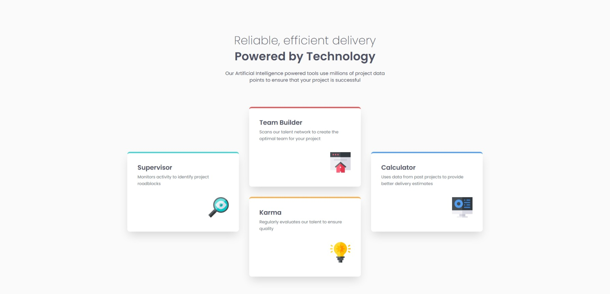

# Frontend Mentor - Four card feature section solution

This is a solution to the [Four card feature section challenge on Frontend Mentor](https://www.frontendmentor.io/challenges/four-card-feature-section-weK1eFYK). 

## Table of contents

- [Overview](#overview)
  - [The challenge](#the-challenge)
  - [Screenshot](#screenshot)
  - [Links](#links)
- [My process](#my-process)
  - [Built with](#built-with)
  - [What I learned](#what-i-learned)
- [Author](#author)

## Overview

### The challenge

Users should be able to:

- View the optimal layout for the site depending on their device's screen size

### Screenshot

### Links

- Live Site URL: [Add live site URL here](https://four-card-feature-ten-brown.vercel.app/)

## My process

### Built with

- Semantic HTML5 markup
- CSS custom properties
- Flexbox
- CSS Grid

### What I learned

This challenge was an easy one. What I learned the most was about the Grid layout, because I’m more comfortable using Flexbox. In this challenge, I could use both Grid and Flexbox.

## Author

- Frontend Mentor - [@Vinicius-PR](https://www.frontendmentor.io/profile/Vinicius-PR)
- Linkedin - [@Vinicius](https://www.linkedin.com/in/vinicius-paula-resende/)
